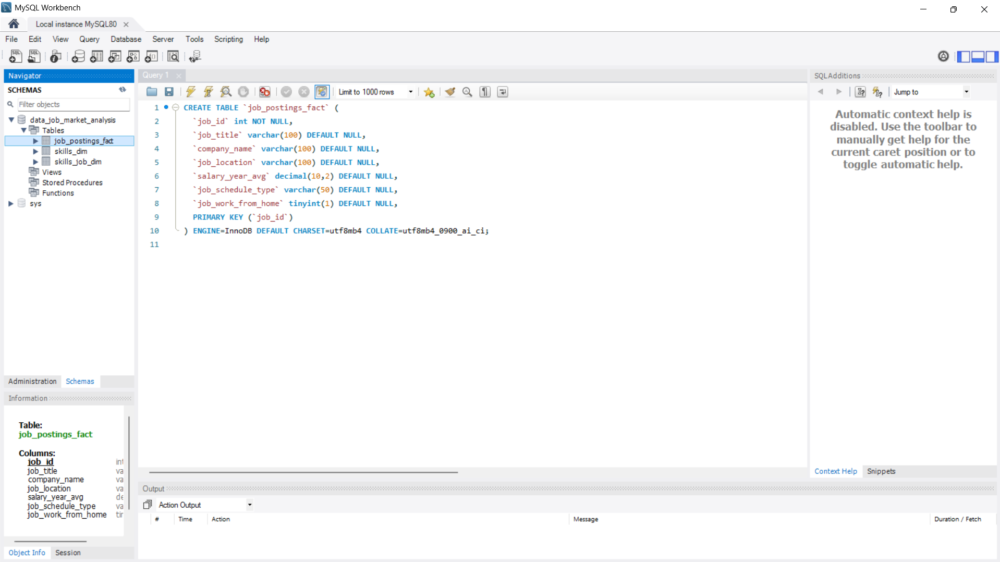
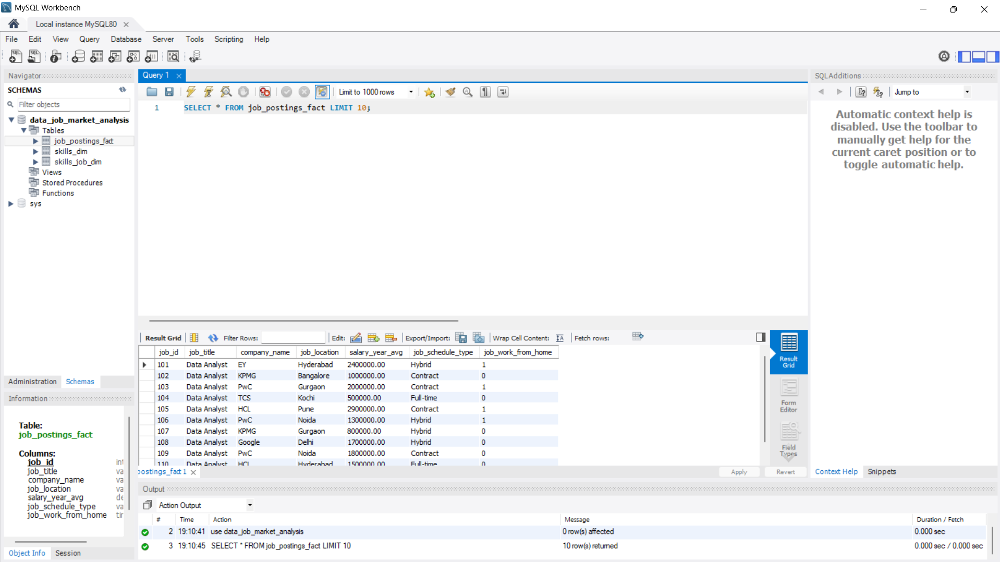
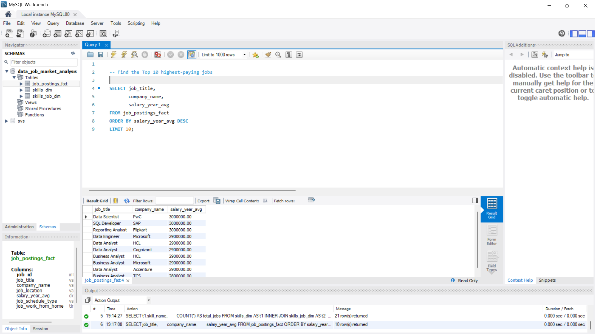
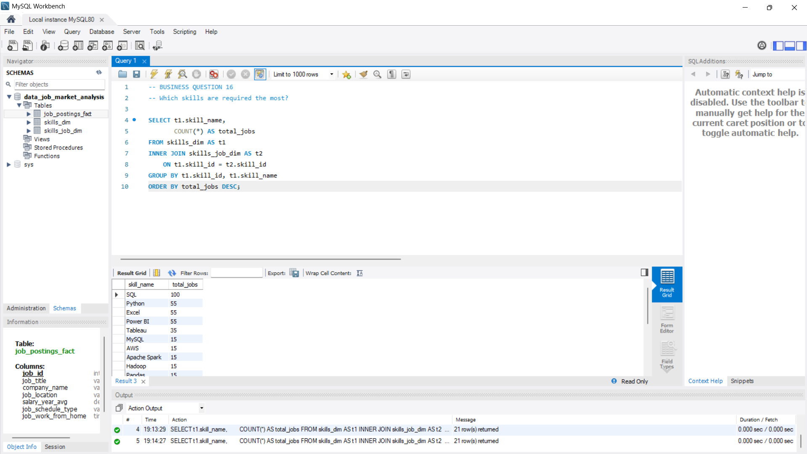
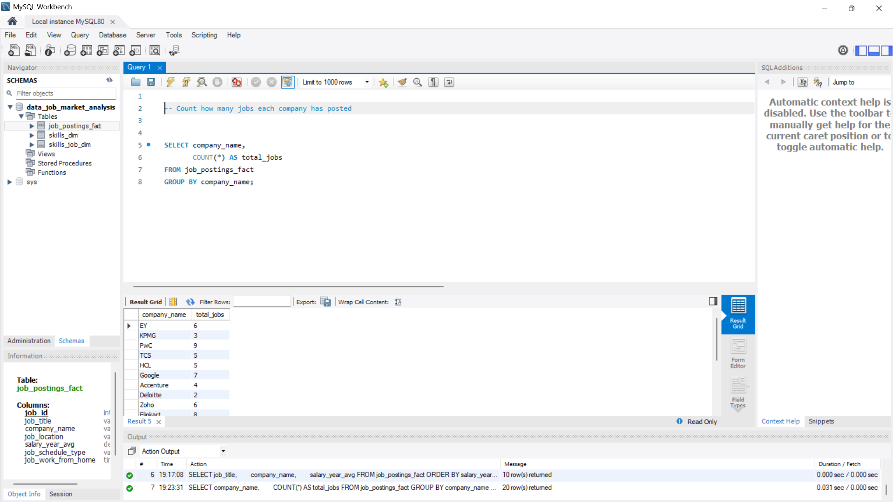
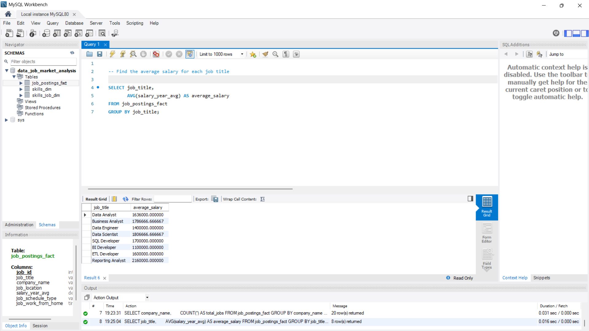
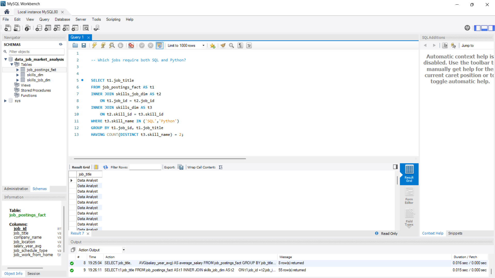
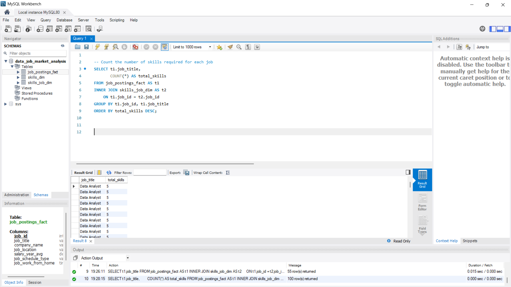
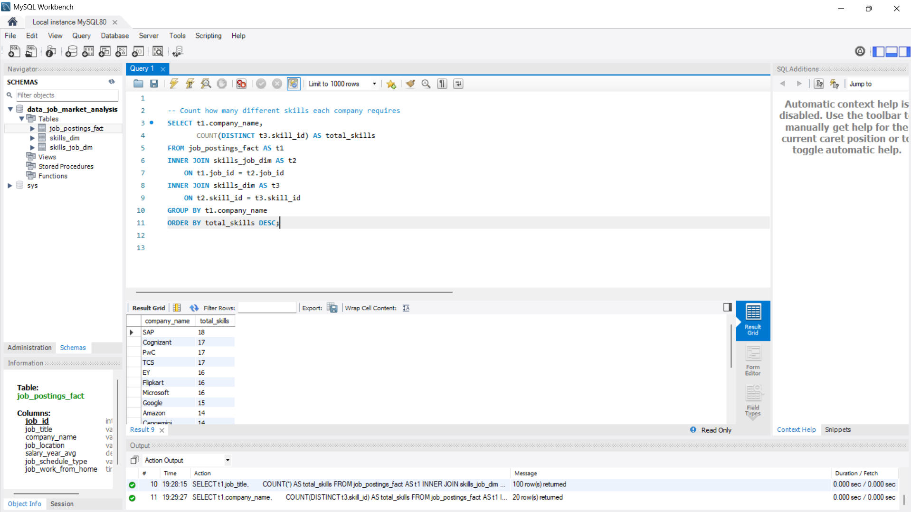

# 📊 SQL Job Market Analysis using MySQL

## 🚀 Project Overview

The SQL Job Market Analysis project is designed to analyze job posting data using MySQL and answer real-world business questions through SQL queries.

The project focuses on understanding hiring trends, salary distribution, required technical skills, and company hiring patterns by working with a relational database consisting of fact and dimension tables.

This project demonstrates practical SQL skills commonly used by Data Analysts, Business Analysts, and SQL Developers.

---

# 🎯 Objectives

The primary objectives of this project are:

- Analyze job market trends
- Identify the most in-demand technical skills
- Discover high-paying job roles
- Compare average salaries across companies
- Understand relationships between jobs and required skills
- Practice writing real-world SQL business queries

---

# 🛠 Technologies Used

- MySQL
- MySQL Workbench
- GitHub

---

# 🗂 Database Design

The database consists of three relational tables.

### 1️⃣ Job_Postings_Fact

Stores job-related information such as:

- Job ID
- Job Title
- Company Name
- Job Location
- Average Salary
- Job Schedule Type
- Work From Home Status

---

### 2️⃣ Skills_Dim

Stores all available technical skills.

Examples:

- SQL
- Python
- Excel
- Tableau
- Power BI
- AWS

---

### 3️⃣ Skills_Job_Dim

Bridge table that connects jobs with skills.

This table establishes a Many-to-Many relationship between Job_Postings_Fact and Skills_Dim.

---

# 🗃 Entity Relationship Diagram (ERD)

*(ER_Diagram.png will be added here.)*

---

# 📈 Business Questions Solved

Examples include:

- Count total job postings
- Find unique job titles
- Find the highest-paying jobs
- Calculate average salary by company
- Identify the most in-demand skills
- Find jobs requiring SQL
- Find jobs requiring SQL and Python
- Count jobs by location
- Find companies hiring the most employees

---

# 💡 SQL Concepts Used

This project demonstrates:

- SELECT
- WHERE
- ORDER BY
- LIMIT
- Aggregate Functions
- COUNT()
- AVG()
- MAX()
- MIN()
- SUM()
- GROUP BY
- HAVING
- INNER JOIN
- Multi-table JOINs

---

# 📂 Project Structure

```text
SQL-Job-Market-Analysis
│
├── README.md
├── schema.sql
├── queries.sql
├── ER_Diagram.png
│
├── Data
│   ├── Job_Postings_Fact_100.csv
│   ├── Skills_Dim_30.csv
│   └── Skills_Job_Dim_500.csv
│
└── Screenshots
    ├── database_tables.png
    ├── query_results.png
    ├── highest_paying_jobs.png
    ├── most_demanded_skills.png
    ├── top_hiring_companies.png
    ├── average_salary_by_job_title.png
    ├── jobs_requiring_sql_and_python.png
    ├── skills_required_per_job.png
    └── company_skill_requirements.png
```

---

# 📸 Project Screenshots

## Database Tables



---

## Query Results



---

## Top 10 Highest Paying Jobs



---

## Most Demanded Skills



---

## Top Hiring Companies



---

## Average Salary by Job Title



---

## Jobs Requiring SQL and Python



---

## Skills Required Per Job



---

## Company Skill Requirements



---

# 🎯 Learning Outcomes

Through this project, I gained hands-on experience in:

- Designing relational databases
- Understanding Primary and Foreign Keys
- Working with Fact and Dimension tables
- Writing SQL business queries
- Solving real-world analytical problems using SQL
- Building a professional GitHub project

---

# 👨‍💻 Author

**Sathwik Chinta**

Aspiring Software Engineer | SQL | Java | Python | DSA
